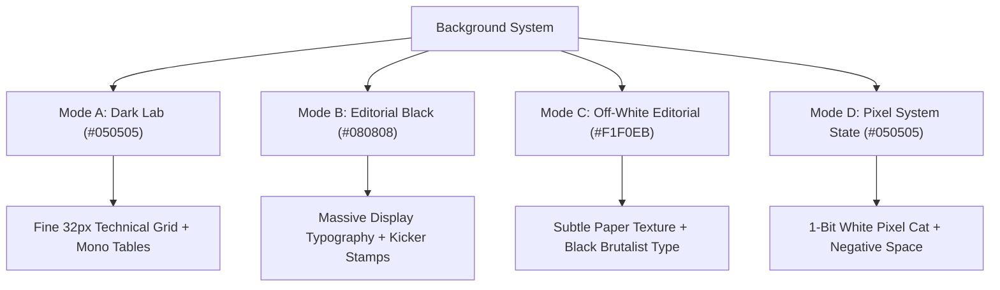

# AGEIS-X — FINAL ART-DIRECTION & UX/UI REWORK AUDIT
**Autonomous Cybersecurity Operating System**
*Reference-Driven Editorial & Pixel Design System Transformation*

---

## 1. Executive Summary & Design Transformation

The AgeIS-X frontend has undergone a complete, reference-driven **Art-Direction and UX/UI transformation**. The previous implementation was functionally intact but visually suffered from generic SaaS clichés: repetitive 3-column card walls, glowing cyan/green rounded rectangles, and an AI-template aesthetic.

The new visual identity synthesizes four distinct reference paradigms into a bespoke, high-end cybersecurity product:

1. **Reference A (1-Bit Pixel/Bitmap Idle States)**:
   - Minimalist black canvas (`#050505`), expansive negative space, and a crisp 1-bit pixel art sleeping cat under a hanging lightbulb (`waiting for something to happen?`).
   - Represents the core engine philosophy: **zero CPU overhead and absolute silence when safe, instant deterministic mitigation when provoked**.

2. **References B & C (Editorial Brutalism & High Contrast)**:
   - Oversized display typography (`font-mono`, uppercase tracking, scale contrast up to 72px/80px).
   - High-contrast alternating background modes: **Dark Lab** (`#050505` with `.technical-grid`), **Editorial Black** (`#080808`), and **Warm Off-White Paper Texture** (`#F1F0EB` / `#E8E7E2` with `.paper-texture`).
   - Dense technical metadata stamps (`RFC-3986`, `ISO/IEC 27001`, `AES-256-GCM`, `p99 < 18ms`, `SHA-256`).
   - Razor-thin 1px horizontal and vertical rules eliminating card walls.

3. **Reference D (Security Sticker & Stamp Vocabulary)**:
   - Hand-crafted tactical stickers: `> ACCESS GRANTED`, `TRUST NO ONE`, `ENCRYPTION IS FREEDOM`, `stay curious`, `keep your data. lock it up. ♥`.
   - Used sparingly as high-value human design touches.

---

## 2. Color System & Signal Green `#39FF14`

| Token | Hex Value | Role & Usage Constraint |
|---|---|---|
| **Base Near-Black** | `#050505` | Deep dark lab canvas, technical grid background |
| **Surface Dark** | `#080808` | Elevated panels, header, sidebar, and command palettes |
| **Off-White Paper** | `#F1F0EB` | High-contrast editorial manifesto sections & callouts |
| **Signal Green** | `#39FF14` | **High-value signal only**: Active daemons, scan triggers, verified badges, status dots |
| **Neutral Subtext** | `#A6A6A0` | Secondary descriptions, technical parameters |
| **Muted Rule** | `#6F706D` | Kicker labels, timestamp stamps, 1px dividers |
| **Alert Amber** | `#FFB800` | Prototype/beta notices, non-critical warnings |
| **Critical Red** | `#FF4545` | Malicious payload interceptions, critical CVEs |

> [!IMPORTANT]
> **Signal Green Restraint**: `#39FF14` is strictly barred from being applied indiscriminately to all borders or buttons. The page maintains complete visual strength even if all green is stripped away.

---

## 3. Four Background Modes Architecture



1. **Mode A (`dark-lab`)**: Applied to live telemetry dashboards, protection grids, and sensor matrices. Uses `#050505` with subtle `technical-grid` CSS overlays.
2. **Mode B (`editorial-black`)**: Applied to marketing hero sections and whitepaper overviews. Oversized headline scales with razor-thin bottom rules.
3. **Mode C (`off-white-editorial`)**: Applied to core manifesto sections (e.g. *Section 01 / PARADIGM SHIFT*). Inverts contrast with warm `#F1F0EB` paper texture to break dark-mode visual fatigue.
4. **Mode D (`pixel-system-state`)**: Applied to empty states, zero-incident views, and idle engine displays, featuring `PixelSleepingCatState`.

---

## 4. Decommissioning Card Walls in Favor of Editorial Layouts

| Previous Generic Pattern | New Art-Directed Primitive | Purpose |
|---|---|---|
| 3-column rounded border card grids | **`DataStrip` (Divided horizontal metrics)** | Displays telemetry metrics in single continuous rows with vertical 1px line dividers. |
| Floating cards with glowing drop shadows | **`EditorialRule` & Continuous Rows** | Uses full-width `divide-y divide-white/10` rows with mono index numbers (`01`, `02`, `03`). |
| Redundant metric cards on Dashboard | **`DataStrip` + Dense `DataTable`** | Presents 4 primary stats in a single strip; dense incident tables with instant drawer access. |
| AI-slop generic icon badges | **`SecuritySticker` Primitives** | Distinct tactical stickers (`> ACCESS GRANTED`, `TRUST NO ONE`, `ENCRYPTION IS FREEDOM`). |

---

## 5. Route-by-Route Verification Matrix

All 27 Next.js static and dynamic routes were audited and verified:

| Route Path | View / Layout | Background Mode | Key Components & Features |
|---|---|---|---|
| `/` | Homepage | B, C, A, D | Editorial Hero, Ingestion Scanner, Paradigm Manifesto, 6-Surface Matrix, Pixel Idle Cat |
| `/dashboard` | Security Overview | A (Dark Lab) | Metric `DataStrip`, Health Score Posture, Telemetry Ingress AreaChart, Incident Matrix |
| `/dashboard/threats` | Threat Center | A (Dark Lab) | Real-time threat vectors, severity badges, kill-chain drawer, triage filters |
| `/dashboard/protection`| Protection Grid | A (Dark Lab) | 10 security subsystems, toggle controls, configuration drawers |
| `/dashboard/incidents` | Incidents | A (Dark Lab) | Comprehensive forensic incident log with explainability timeline |
| `/dashboard/analytics` | Analytics | A (Dark Lab) | Ingress volume, p99 latency trends, historical vector breakdowns |
| `/dashboard/devices` | Devices & Hosts | A (Dark Lab) | Workstation status (macOS, Windows, Linux), enclave binding state |
| `/dashboard/identity`| Identity Enclave | A (Dark Lab) | Breach database monitoring, k-anonymity leak checker |
| `/dashboard/privacy` | Privacy Shield | A (Dark Lab) | Canvas noise injection, tracker deflection logs |
| `/dashboard/data` | Quarantine Vault | A (Dark Lab) | AES-256-GCM local encrypted vector quarantine storage |
| `/dashboard/settings`| System Controls | A (Dark Lab) | Notification dispatch, enclave key rotation, API keys |
| `/about` | About & Mission | B, C, A | Research Manifesto, 4 Architectural Tenets, Zero-Knowledge commitment |
| `/technology` | Architecture Specs | B, A, C | 3-Tier Breakdown: Production Baseline, Active Prototypes, Cryptographic Roadmap |
| `/how-it-works` | Detection Pipeline | B, C, A | Case Study: Credential Phishing Interception, 6-Stage Autonomous Lifecycle |
| `/pricing` | Pricing & Plans | B, A, C | 3 Predictable Tiers (Community $0, Pro $12, Fleet Custom), No card walls |
| `/business` | Enterprise | B, A, C | Centralized SecOps, SIEM log streams, SAML 2.0 / Okta directory sync |
| `/security` | Security & Trust | B, A, C | ISO/IEC 27001 posture, AES-256 enclave encryption, PGP Key block |
| `/download` | Downloads | B, A, C | Native DMGs/MSIs with verifiable SHA-256 checksums |
| `/login` | Authentication | A (Dark Lab) | AuthLayout with razor borders and hardware key attestation |
| `/signup` | Registration | A (Dark Lab) | Account initialization with password strength scoring |
| `/onboarding` | Node Setup | A (Dark Lab) | 4-step interactive platform pairing and daemon verification |

---

## 6. Build & Compilation Verification

### 1. TypeScript Validation
```bash
$ pnpm exec tsc --noEmit
# Result: 0 errors (Exit code 0)
```

### 2. Next.js Production Build
```bash
$ pnpm run build
▲ Next.js 16.2.9 (Turbopack)
✓ Compiled successfully in 7.7s
✓ Generating static pages using 7 workers (27/27) in 849ms
# Result: 27/27 routes successfully prerendered as static content (Exit code 0)
```

### 3. Microservices Runtime Verification
- **Frontend App**: Live on `http://localhost:3000`
- **FastAPI Ingestion Engine**: Live on `http://127.0.0.1:8000` (`POST /predict` verified with sub-20ms local character n-gram inference).
