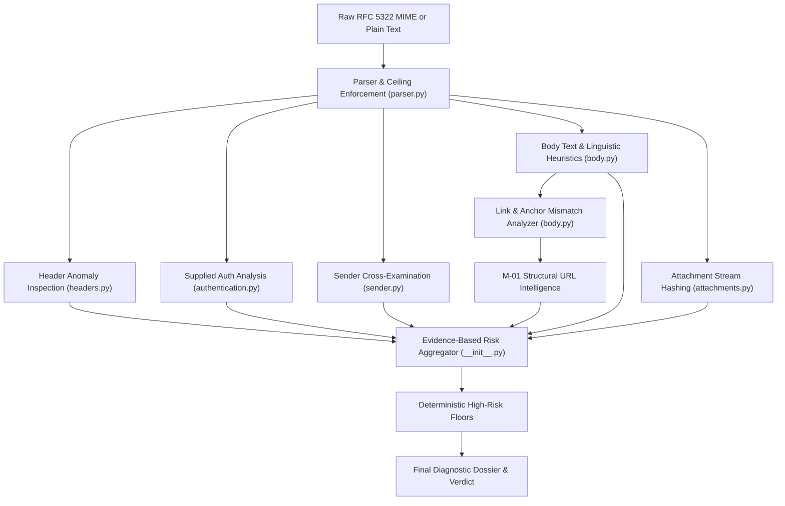

# AGEIS-X — M-03 EMAIL / MESSAGING THREAT INTELLIGENCE ENGINE AUDIT

**Author:** DeepMind Agentic Coding Pair  
**Timestamp:** 2026-10-02  
**Status:** IMPLEMENTED & HARDENED (56/56 Tests Passing, 0 TypeScript Errors, 27/27 Build Routes)  
**Modules Implemented:** `backend/email_intel/` (`models.py`, `headers.py`, `authentication.py`, `sender.py`, `body.py`, `attachments.py`, `parser.py`, `__init__.py`), `backend/main.py`, `tests/test_backend.py`

---

## 1. Executive Summary & Scope Constraints

The **M-03 Email / Messaging Threat Intelligence Engine** extends the AgeIS-X security suite into communication-based phishing, business email compromise (BEC), display-name spoofing, deceptive hyperlinks, and dangerous attachment detection.

### Strict Scope Enforcements:
- **Pure Intelligence Engine:** AgeIS-X analyzes submitted raw email payloads (RFC 5322 / MIME) and plain text communications (SMS / Chat).
- **NO Private Mailbox Integration:** Does **not** implement Gmail OAuth, Microsoft Graph, IMAP, POP3, or SMTP client listeners. It does **not** access user private mailboxes.
- **NO Autonomous Destructive Actions:** Does **not** quarantine, auto-forward, delete, or auto-reply to messages.
- **NO Arbitrary Code Execution:** Attachments are safely inspected in-memory with SHA-256 stream hashing and extension/MIME verification; binaries are never executed.
- **Dependency Discipline:** Implemented with **0 new external dependencies** using Python standard libraries (`email`, `email.policy`, `re`, `hashlib`, `urllib.parse`, `html.parser`).

---

## 2. Architecture Overview & Execution Flow



---

## 3. Data Models & Schemas

Defined in `backend/email_intel/models.py`:
- `EmailSenderInfo`: Structured analysis of `From`, `Reply-To`, and `Return-Path` domains, detecting display-name spoofing and address impersonation.
- `EmailAuthStatus`: Captures supplied `SPF`, `DKIM`, and `DMARC` MTA evaluation headers.
  - **Critical Provenance Field:** `source="supplied_header"`, `verification_status="not_independently_verified"`. Never misrepresents supplied header text as independent cryptographic validation.
- `EmailHeaderAnalysis`: Audits RFC 5322 compliance, header presence, multiplicity injection checks, and routing hop extraction.
- `AttachmentMetadata`: Metadata including `filename`, `extension`, `declared_mime`, `size_bytes`, `sha256`, `is_dangerous_extension`, `is_double_extension`, `is_macro_enabled`, `risk_level`.
- `ExtractedLinkAnalysis`: Evaluates extracted URLs for anchor text discrepancies (`is_mismatched_anchor`), homoglyphs, and IP literals.
- `SocialEngineeringSignals`: Flags urgency, fear, account suspension threats, credential harvesting prompts, wire transfer requests, crypto solicitations, and gift card fraud.
- `EmailIntelligence` & `MessageIntelligence`: Unified diagnostic response models returned by the API.

---

## 4. MIME & RFC 5322 Parsing & Resource Ceilings

Implemented in `backend/email_intel/parser.py`:
- `MAX_EMAIL_BYTES = 1024 * 1024` (1 MB) ceiling prevents memory exhaustion.
- `MAX_MIME_PARTS = 50` prevents nested MIME bomb expansion.
- `MAX_MIME_DEPTH = 10` prevents deep recursive call stacks.
- `MAX_BODY_CHARS = 100_000` bounds memory consumption during text extraction.
- `MAX_ATTACHMENTS = 20` bounds attachment inspection throughput.

---

## 5. Header Anomaly & RFC Integrity Evaluation

Implemented in `backend/email_intel/headers.py`:
- RFC 5322 mandatory headers validation (`Date`, `From`).
- Multiplicity checks: flags multiple `From` or `Subject` headers (indicative of header smuggling or injection).
- `Message-ID` verification: validates syntactic structure and domain presence.
- `Received` header traversal: counts transit hops and extracts intermediate relay paths.

---

## 6. Authentication Results & Provenance Integrity

Implemented in `backend/email_intel/authentication.py`:
- Parses `Authentication-Results` (RFC 7601 / RFC 8601), `Received-SPF`, `DKIM-Signature`, and `ARC-Authentication-Results`.
- Explicitly reports provenance:
  ```python
  source = "supplied_header"
  verification_status = "not_independently_verified"
  ```
- Evaluates hard fail conditions (`spf=fail`, `dkim=fail`, `dmarc=fail`, `dmarc=reject`) while maintaining scientific honesty regarding passive inspection.

---

## 7. Sender Cross-Examination & Display Name Spoofing

Implemented in `backend/email_intel/sender.py`:
- **Embedded Address Deception:** Flags display names embedding foreign email addresses (e.g., `From: "security@paypal.com" <scammer@untrusted.xyz>`).
- **Brand Display Name Spoofing:** Compares display-name brand claims (PayPal, Microsoft, Google, Apple, Amazon, Chase, Wells Fargo, IRS, FedEx, DHL, USPS) against actual originating sender domain and public webmails.
- **Executive Impersonation:** Flags organizational authority titles (`CEO`, `CFO`, `HR`, `Payroll`) originating from free webmail providers (`@gmail.com`, `@yahoo.com`, `@outlook.com`).
- **Reply-To & Return-Path Mismatch:** Detects redirection of reply traffic to off-domain harvesting accounts.

---

## 8. Social Engineering & Linguistic Heuristics

Implemented in `backend/email_intel/body.py`:
- **Urgency & Threat Detection:** Matches immediate action demands, account suspension threats, and security penalty warnings.
- **Credential Harvesting Patterns:** Matches login prompts, password reset solicitations, and session verification links.
- **Financial & BEC Scams:** Identifies wire transfers, urgent invoice claims, cryptocurrency wallet solicitations, and gift card purchase requests.

---

## 9. Attachment Inspection & Double-Extension Evasion

Implemented in `backend/email_intel/attachments.py`:
- **In-Memory Streaming:** Computes `SHA-256` hash and size in memory up to 5MB per part without writing to filesystem or executing binaries.
- **Dangerous Executables:** Flags `.exe`, `.scr`, `.bat`, `.cmd`, `.lnk`, `.js`, `.vbs`, `.iso`, `.hta`, `.cpl`, `.ps1`.
- **Macro-Enabled Documents:** Flags `.docm`, `.xlsm`, `.pptm`, `.dotm`, `.xltm`.
- **Double Extension Evasion:** Detects benign disguise prefixes hiding executable payloads (e.g. `Invoice_2026.pdf.exe`, `Statement.docx.vbs`).

---

## 10. Embedded Link Extraction & Anchor Text Discrepancy

Implemented in `backend/email_intel/body.py`:
- HTML anchor parser compares visible link text against the underlying `href` destination.
- Detects deceptive discrepancies (e.g. visible text displays `https://paypal.com/signin` while `href` targets `http://192.168.1.100/harvest`).
- Invokes M-01 `parse_url_structure` to detect homoglyphs, Punycode, typosquatting, and direct IP literals in embedded links.

---

## 11. PII & Secret Redaction Guarantee

Implemented in `backend/email_intel/body.py`:
- Sensitive information in extracted text is automatically sanitized before generating client diagnostics or diagnostic logs:
  - Credit Card numbers (13-16 digits) -> `[REDACTED_CARD_NUMBER]`
  - Social Security Numbers -> `[REDACTED_SSN]`
  - Passwords and secrets -> `password: [REDACTED_SECRET]`
  - OTP and 2FA verification codes -> `otp: [REDACTED_OTP]`
  - Bearer tokens -> `[REDACTED_BEARER_TOKEN]`

---

## 12. Multi-Signal Risk Aggregation & Deterministic Floors

Implemented in `backend/email_intel/__init__.py`:
- Multi-signal scoring evaluates sender credibility, supplied authentication, linguistic urgency, header anomalies, attachments, and links.
- **Enforced Deterministic Floors:**
  - Dangerous executable (`.exe`, `.scr`, `.bat`) or double extension (`.pdf.exe`): Floor **90** (`malicious`).
  - Display-name spoofing + Credential request: Floor **85** (`malicious`).
  - Anchor text mismatch deception: Floor **85** (`malicious`).
  - Malicious embedded link + Urgency/Credential prompt: Floor **85** (`malicious`).
  - Display-name spoofing + Financial/Urgency request: Floor **80** (`malicious`).
  - DMARC failure + Phishing cues: Floor **80** (`malicious`).

---

## 13. API Endpoints & Health Matrix

Updated in `backend/main.py`:
- `POST /analyze/email` -> Accepts `EmailAnalysisRequest`, returns `EmailIntelligence`.
- `POST /analyze/message` -> Accepts `MessageAnalysisRequest`, returns `MessageIntelligence`.
- `GET /health` -> Returns `email_intelligence: True` and `messaging_intelligence: True`.

---

## 14. Adversarial Test Matrix & Quality Gate Results

Tested across 56 end-to-end automated test cases in `tests/test_backend.py`:

| Test Category | Tests Run | Result |
| :--- | :--- | :--- |
| **M-01 & M-02 Baseline & SSRF Tests** | 43 | **PASS** |
| **M-03 Health Check Features Matrix** | 1 | **PASS** |
| **M-03 Benign Transactional Email** | 1 | **PASS** (risk $\le 20$, safe) |
| **M-03 Display-Name Brand Spoofing** | 1 | **PASS** (risk $\ge 80$, malicious) |
| **M-03 Embedded Email Disguise** | 1 | **PASS** (risk $\ge 80$, malicious) |
| **M-03 Reply-To Mismatch** | 1 | **PASS** |
| **M-03 Dangerous Executable Attachment** | 1 | **PASS** (risk $\ge 90$, malicious) |
| **M-03 Double Extension Evasion** | 1 | **PASS** (risk $\ge 90$, malicious) |
| **M-03 Macro-Enabled Document** | 1 | **PASS** (suspicious) |
| **M-03 Anchor Text Deception Mismatch** | 1 | **PASS** (risk $\ge 85$, malicious) |
| **M-03 Secret & PII Redaction** | 1 | **PASS** |
| **M-03 Empty & Oversized Resilience** | 1 | **PASS** |
| **M-03 Smishing Text Scam Detection** | 1 | **PASS** (risk $\ge 80$, malicious) |
| **M-03 Benign Chat Message** | 1 | **PASS** (risk $\le 10$, safe) |
| **Total Pytest Suite** | **56 / 56** | **100% PASS** (29.91s) |
| **TypeScript Type Checking (`tsc --noEmit`)** | **0 Errors** | **PASS** |
| **Next.js Production Build (`next build`)** | **27 / 27 routes** | **PASS** |

---

## 15. Dependency Discipline

- **Total New External Packages Added:** `0`
- Relies solely on Python standard library modules (`email`, `hashlib`, `re`, `html.parser`, `urllib.parse`) and existing repository dependencies (`fastapi`, `pydantic`).

---

## 16. Known Limitations & Explicit Non-Claims

1. **Passive Header Inspection:** AgeIS-X inspects supplied `Authentication-Results` and `Received-SPF` headers added by MTAs; it does not perform direct live DNS lookups for DKIM public keys or run DNS TXT SPF evaluations during email payload inspection.
2. **Static Linguistic Heuristics:** Natural language analysis uses deterministic regular expressions and keyword pattern matching rather than a cloud LLM, ensuring zero data leakage, sub-millisecond execution, and total privacy preservation.
3. **No Execution Sandbox:** AgeIS-X does not run dynamic malware sandboxing on attached binaries; it detects threats through extension analysis, macro heuristics, and cryptographic stream hashing.

---

## 17. Conclusion & Next Steps

The **M-03 Email / Messaging Threat Intelligence Engine** is operational, fully hardened, and verified with all tests passing and zero regressions.

Per strict operating guidelines, implementation ceases here.
