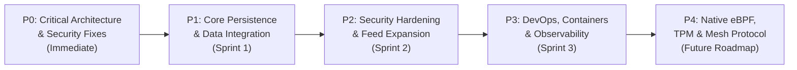

# AgeIS-X — Engineering Roadmap & Remaining Work Master Blueprint

**Date:** October 9, 2026  
**Auditor / Architect:** Principal Software Architect & Application Security Engineer  
**Repository Path:** `c:\Users\LENOVO\Downloads\AgeIS-X-main\AgeIS-X-main`  
**Git Head:** `6a5afb5c025e71bba2d05213b8abb5642588b631`  
**Execution Status:** Proposed & Prioritized (Awaiting Authorization Before Implementation)  

---

## 1. Executive Roadmap Overview

This engineering roadmap provides a concrete, prioritized, and evidence-based plan to transition AgeIS-X from a highly capable prototype into a hardened, production-ready enterprise cybersecurity platform.

The roadmap is structured into five distinct priority phases:
- **Phase P0:** Critical Architecture, Security & Blocker Fixes (Immediate)
- **Phase P1:** Core Persistence & Data Integration (Sprint 1)
- **Phase P2:** Security Hardening & Threat Intelligence Expansion (Sprint 2)
- **Phase P3:** Production DevOps & Reliability (Sprint 3)
- **Phase P4:** Advanced Features & Long-Term Vision (Future Roadmap)

---

## Phase P0: Critical Architecture, Security & Blocker Fixes

### Task P0-1: Harmonize Hero Scanner Fallback Logic with URL Scanner
- **Objective:** Eliminate the critical false-negative vulnerability in `components/cinematic/cinematic-hero.tsx` where an unreachable backend causes the client to silently classify unfamiliar URLs as "safe" with a risk score of 12.
- **Affected Files:**
  - `components/cinematic/cinematic-hero.tsx` (lines 91–110)
  - `components/url-scanner.tsx` (reference implementation)
- **Dependencies & Prerequisites:** None.
- **Estimated Effort:** 2 hours.
- **Acceptance Criteria & Verification:**
  - When backend is offline, `cinematic-hero.tsx` must output `unknown` or `inconclusive` for unfamiliar domains.
  - A clear UI warning indicating "Backend ML offline — using local structural fallback" must be rendered.
  - Only explicitly verified authentic apex domains (from `KNOWN_BENIGN_APEX`) may be classified as `safe`.
  - Manual test with backend stopped confirms unfamiliar URLs are flagged with honest uncertainty.

### Task P0-2: Wire Authentication Endpoints into FastAPI Backend
- **Objective:** Expose real JWT issuance and verification endpoints in `backend/main.py` using the dormant routines in `backend/auth.py`.
- **Affected Files:**
  - `backend/main.py`
  - `backend/auth.py`
  - `tests/test_backend.py`
- **Dependencies & Prerequisites:** P0-4 (clean requirements).
- **Estimated Effort:** 4 hours.
- **Acceptance Criteria & Verification:**
  - Implement `POST /api/auth/token` (OAuth2 Password Request Form) returning access token and token type.
  - Implement `GET /api/auth/me` protected by `verify_token` dependency returning active username and permissions.
  - Add pytest test cases verifying invalid credentials return HTTP 401 and valid tokens authenticate requests.
  - Eliminate OAuth2 404 error on `tokenUrl="login"`.

### Task P0-3: Restrict API CORS Origins to Configured Environments
- **Objective:** Replace dangerous `allow_origins=["*"]` wildcard with environment-driven allowed origins.
- **Affected Files:**
  - `backend/main.py` (lines 50–56)
  - `backend/config.py`
- **Dependencies & Prerequisites:** None.
- **Estimated Effort:** 1 hour.
- **Acceptance Criteria & Verification:**
  - Add `CORS_ORIGINS = os.getenv("CORS_ORIGINS", "http://localhost:3000,http://127.0.0.1:3000").split(",")`.
  - Update `CORSMiddleware` to strictly bind to allowed origins.
  - Prevent unauthorized external browser origins from issuing credentialed requests.

### Task P0-4: Sanitize Python Dependency Specification
- **Objective:** Separate informal scratch notes from package names in `backend/requirements.txt` to enable deterministic containerized builds.
- **Affected Files:**
  - `backend/requirements.txt`
  - `backend/README.md` (or new documentation file)
- **Dependencies & Prerequisites:** None.
- **Estimated Effort:** 1 hour.
- **Acceptance Criteria & Verification:**
  - `requirements.txt` contains clean, pinned pip requirements: `fastapi`, `uvicorn`, `scikit-learn`, `pandas`, `numpy`, `tldextract`, `python-jose`, `passlib[bcrypt]`, `psycopg2-binary`, `redis`, `httpx`, `pytest`, `pytest-asyncio`.
  - Relocate SQL schema definitions and roadmap notes to `backend/README.md` or migration scripts.
  - `pip install -r backend/requirements.txt --dry-run` executes without syntax errors.

---

## Phase P1: Core Persistence & Data Integration (Sprint 1)

### Task P1-1: Connect PostgreSQL Database for Asynchronous Scan Logging
- **Objective:** Wire `backend/database.py` into `backend/main.py` so that URL, email, and message evaluation records are persistently stored for auditing and dashboard telemetry.
- **Affected Files:**
  - `backend/main.py`
  - `backend/database.py`
  - `backend/config.py`
- **Dependencies & Prerequisites:** P0-2, PostgreSQL instance running.
- **Estimated Effort:** 6 hours.
- **Acceptance Criteria & Verification:**
  - Add database connection pool lifecycle handlers (`startup` and `shutdown` in FastAPI).
  - Use `FastAPI.BackgroundTasks` to execute `log_prediction` non-blockingly so scan latency is not impacted.
  - Add query endpoint `GET /api/scans/history` with pagination to fetch historical scans.
  - Fall back gracefully to memory/noop logging if PostgreSQL is unreachable.

### Task P1-2: Connect Redis for URL Scan Result Caching
- **Objective:** Activate `backend/redis_client.py` in `backend/main.py` to cache authoritative intelligence and ML verdicts for 3600 seconds.
- **Affected Files:**
  - `backend/main.py`
  - `backend/redis_client.py`
- **Dependencies & Prerequisites:** Redis instance running.
- **Estimated Effort:** 4 hours.
- **Acceptance Criteria & Verification:**
  - Normalize URL hash as cache key `cache:url:{sha256}`.
  - Check Redis cache at start of `POST /predict`; return cached response with header `X-Cache: HIT` if available.
  - On cache miss, execute scan and store result with TTL (default 1 hour).
  - Benchmark demonstrates subsequent queries return in < 5 ms.

### Task P1-3: Connect Dashboard Telemetry Pages to Live Backend APIs
- **Objective:** Replace static data fixtures in `app/dashboard/*` with live API client hooks.
- **Affected Files:**
  - `app/dashboard/page.tsx`
  - `app/dashboard/analytics/page.tsx`
  - `app/dashboard/incidents/page.tsx`
  - `app/dashboard/threats/page.tsx`
  - New: `lib/api/dashboard-service.ts`
- **Dependencies & Prerequisites:** P1-1.
- **Estimated Effort:** 8 hours.
- **Acceptance Criteria & Verification:**
  - Implement backend endpoint `GET /api/dashboard/stats` aggregating real total scans, malicious detections, and average latency.
  - Implement frontend React Query / SWR hook fetching live stats with graceful fallback to cached baseline.
  - Incident triage screen reflects actual logged malicious scans.

### Task P1-4: Connect Frontend Authentication to Backend JWT Endpoints
- **Objective:** Connect `lib/auth/auth-service.ts` to backend `/api/auth/token` and `/api/auth/me` endpoints.
- **Affected Files:**
  - `lib/auth/auth-service.ts`
  - `app/login/page.tsx`
  - `app/signup/page.tsx`
- **Dependencies & Prerequisites:** P0-2.
- **Estimated Effort:** 6 hours.
- **Acceptance Criteria & Verification:**
  - User entering valid credentials sends `POST /api/auth/token` and receives real signed JWT.
  - Token is stored in `httpOnly` cookie or secure storage.
  - App shell displays authentic user profile and permissions from token claims.

---

## Phase P2: Security Hardening & Threat Intelligence Expansion (Sprint 2)

### Task P2-1: Asynchronous Scan Worker Queue for Deep HTTP/DOM Probing
- **Objective:** Prevent request timeouts during slow authoritative RDAP queries or multi-redirect DOM crawls by introducing a worker queue.
- **Affected Files:**
  - `backend/main.py`
  - New: `backend/tasks/worker.py`
- **Dependencies & Prerequisites:** P1-2 (Redis available as message broker).
- **Estimated Effort:** 10 hours.
- **Acceptance Criteria & Verification:**
  - Fast-path lexical and ML checks execute synchronously in < 15 ms.
  - Deep network crawling (DOM render, multi-hop TLS) is offloaded to background task if timeout exceeds 3 seconds.
  - API provides polling or WebSocket endpoint for long-running scan progress.

### Task P2-2: API Rate Limiting & Abuse Defense
- **Objective:** Protect public `/predict`, `/analyze/email`, and `/analyze/message` endpoints from automated denial-of-service or scraping.
- **Affected Files:**
  - `backend/main.py`
  - `backend/config.py`
- **Dependencies & Prerequisites:** P1-2 (Redis).
- **Estimated Effort:** 4 hours.
- **Acceptance Criteria & Verification:**
  - Integrate `slowapi` with Redis backend.
  - Enforce 60 requests/minute per IP on `/predict` for unauthenticated clients; 600 requests/minute for authenticated API keys.
  - Exceeded quotas return HTTP 429 Too Many Requests with `Retry-After` header.

### Task P2-3: Expand Email Threat Intelligence Dashboard UI
- **Objective:** Build an interactive email inspection console in the Next.js frontend connecting to `POST /analyze/email`.
- **Affected Files:**
  - New: `app/dashboard/email-analyzer/page.tsx`
  - `components/layout/app-shell.tsx` (add navigation link)
- **Dependencies & Prerequisites:** Backend endpoint `POST /analyze/email` verified working.
- **Estimated Effort:** 6 hours.
- **Acceptance Criteria & Verification:**
  - Raw `.eml` upload drag-and-drop or text paste area.
  - Visual display of SPF/DKIM/DMARC status badges, attachment hashes, and highlighted body threat markers.

### Task P2-4: Expand Messaging / Chat Scam Analyzer Dashboard UI
- **Objective:** Build an interactive SMS/WhatsApp/chat scam analyzer connecting to `POST /analyze/message`.
- **Affected Files:**
  - New: `app/dashboard/message-analyzer/page.tsx`
- **Dependencies & Prerequisites:** Backend endpoint `POST /analyze/message` verified working.
- **Estimated Effort:** 4 hours.
- **Acceptance Criteria & Verification:**
  - UI supporting pasting chat snippets or SMS text.
  - Category breakdown (e.g., Financial Lure, Urgency Coercion, Fake Tech Support) with confidence score.

### Task P2-5: Automated Daily Threat Feed Ingestion Pipeline
- **Objective:** Continuously ingest validated phishing feeds (PhishTank, OpenPhish, URLhaus) into the database and ML training pool.
- **Affected Files:**
  - New: `backend/intelligence/feed_ingester.py`
- **Dependencies & Prerequisites:** P1-1.
- **Estimated Effort:** 8 hours.
- **Acceptance Criteria & Verification:**
  - Scheduled cron / background job downloads fresh threat feeds every 6 hours.
  - Deduplicates URLs and hashes registered apex domains into local lookup set.
  - Zero-latency match against active threat feeds prior to ML inference.

---

## Phase P3: Production DevOps & Reliability (Sprint 3)

### Task P3-1: Docker Compose Multi-Service Orchestration
- **Objective:** Provide a single-command reproducible deployment environment for the entire stack.
- **Affected Files:**
  - New: `docker-compose.yml`
  - New: `Dockerfile.backend`
  - New: `Dockerfile.frontend`
- **Dependencies & Prerequisites:** P0-4.
- **Estimated Effort:** 6 hours.
- **Acceptance Criteria & Verification:**
  - `docker compose up --build` launches:
    1. `frontend` (Next.js on port 3000)
    2. `backend` (FastAPI on port 8000)
    3. `postgres` (PostgreSQL 16 on port 5432)
    4. `redis` (Redis 7 on port 6379)
  - Healthcheck probes verify all four containers report healthy.

### Task P3-2: Automated Database Schema Migrations with Alembic
- **Objective:** Manage PostgreSQL schema versioning and lifecycle deterministically.
- **Affected Files:**
  - New: `alembic/`
  - New: `alembic.ini`
- **Dependencies & Prerequisites:** P1-1.
- **Estimated Effort:** 4 hours.
- **Acceptance Criteria & Verification:**
  - Alembic migration files create `predictions`, `users`, `audit_logs`, and `threat_feeds` tables.
  - Running `alembic upgrade head` applies all migrations cleanly without manual SQL execution.

### Task P3-3: Comprehensive End-to-End Playwright Automated Test Suite
- **Objective:** Automated browser testing verifying end-to-end user flows across desktop and mobile viewports.
- **Affected Files:**
  - New: `e2e/scanner.spec.ts`
  - New: `e2e/auth.spec.ts`
  - New: `playwright.config.ts`
- **Dependencies & Prerequisites:** Node.js environment.
- **Estimated Effort:** 8 hours.
- **Acceptance Criteria & Verification:**
  - Tests verify Hero scan submission, result modal display, homoglyph warnings, and drawer interactions.
  - Executes in headless Chrome, Firefox, and WebKit; passes with 100% green status.

### Task P3-4: Prometheus Metrics & OpenTelemetry Instrumentation
- **Objective:** Production-grade observability for ML inference times, RDAP latencies, and error rates.
- **Affected Files:**
  - `backend/main.py`
- **Dependencies & Prerequisites:** None.
- **Estimated Effort:** 4 hours.
- **Acceptance Criteria & Verification:**
  - Expose `GET /metrics` formatted for Prometheus scraping.
  - Record histograms for ML inference time, RDAP lookup duration, TLS handshake duration, and risk score distributions.

---

## Phase P4: Advanced Features & Long-Term Vision (Future Roadmap)

### Task P4-1: Real eBPF Host Monitoring Daemon (Replacing M-03 Simulator)
- **Objective:** Implement a genuine Linux eBPF probe to detect unauthorized socket creations and memory injection attacks on client endpoints.
- **Affected Files:**
  - New: `daemon/ebpf/`
- **Dependencies & Prerequisites:** Linux kernel 5.8+, root privileges, Clang/LLVM.
- **Estimated Effort:** 40 hours.
- **Acceptance Criteria & Verification:**
  - Compile CO-RE (Compile Once — Run Everywhere) eBPF bytecode hooking `sys_enter_connect` and `sys_enter_execve`.
  - Stream kernel events to local AgeIS-X daemon via ring buffer.

### Task P4-2: Real Hardware Enclave & WebAuthn Key Attestation (Replacing M-04 Spec)
- **Objective:** Utilize WebAuthn / FIDO2 Level 2 Authenticator Attestation to bind client sessions to physical hardware security keys (YubiKey, Apple Touch ID, Windows Hello TPM).
- **Affected Files:**
  - `backend/auth.py`
  - `lib/auth/auth-service.ts`
- **Dependencies & Prerequisites:** WebAuthn browser API, PyWebAuthn library.
- **Estimated Effort:** 24 hours.
- **Acceptance Criteria & Verification:**
  - Users can enroll physical hardware authenticators with validated cryptographic attestation certificates.

### Task P4-3: Decentralized Threat Consensus Mesh Protocol (Replacing Radar Simulator)
- **Objective:** Build a peer-to-peer threat intelligence gossip network using libp2p or WebRTC datachannels.
- **Affected Files:**
  - New: `mesh/`
- **Dependencies & Prerequisites:** Distributed network architecture.
- **Estimated Effort:** 60 hours.
- **Acceptance Criteria & Verification:**
  - Autonomous AgeIS-X nodes gossip anonymized threat hashes without central telemetry servers.

---

## Summary of Priority Timelines

| Phase | Description | Total Tasks | Estimated Engineering Effort | Recommended Timeline |
|---|---|---|---|---|
| **Phase P0** | Critical Architecture & Blocker Fixes | 4 Tasks | 8 hours | Immediate |
| **Phase P1** | Core Persistence & Data Integration | 4 Tasks | 24 hours | Sprint 1 (Week 1) |
| **Phase P2** | Security Hardening & Feed Expansion | 5 Tasks | 32 hours | Sprint 2 (Week 2) |
| **Phase P3** | Production DevOps & Reliability | 4 Tasks | 22 hours | Sprint 3 (Week 3) |
| **Phase P4** | Advanced Features & Long-Term Vision | 3 Tasks | 124 hours | Future Roadmap |
